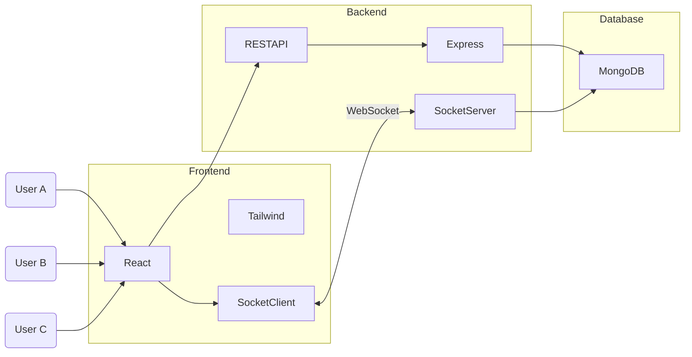
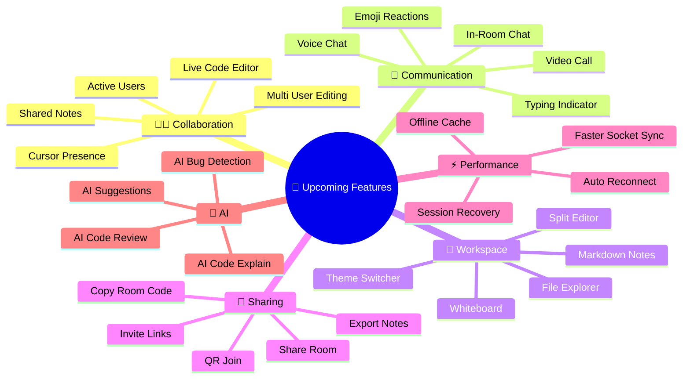

# 

### 🚀 Code Together. Collaborate Instantly. Build Faster.

---

# 📖 Overview

**Real-Time Developer Collaboration Platform** is a modern collaborative workspace that enables multiple users to join a shared room using a unique room code and collaborate instantly without authentication.

The platform focuses on **real-time synchronization**, **low-latency communication**, **shared code editing**, **note sharing**, and **team productivity** powered by Socket.io.

---

# 🏗️ System Architecture

---

# 🚀 Implementation Plan

| 🏗️ Module                        | 📋 Implementation Tasks                                                                                                                                                                                                                                             |
| --------------------------------- | ------------------------------------------------------------------------------------------------------------------------------------------------------------------------------------------------------------------------------------------------------------------- |
| 🎨 **Frontend Development**       | • Build responsive UI with React.js & Tailwind CSS • Create reusable components • Develop Home, Create Room & Join Room pages • Build Collaboration Dashboard • Integrate Socket.io Client • Manage application state • Implement live UI updates |
| ⚙️ **Backend Development**        | • Setup Express.js server • Build RESTful APIs • Configure middleware & routing • Connect MongoDB database • Setup Socket.io server • Manage room creation & joining • Handle active user sessions                                                |
| 🗄️ **Database Management**       | • Design MongoDB collections • Store room information • Store shared code & notes • Maintain active sessions • Handle persistent collaboration data                                                                                                     |
| ⚡ **Real-Time Communication**     | • Establish Socket.io connection • Join & Leave room events • Broadcast updates instantly • Synchronize code editor • Synchronize shared notes • Update online users in real time                                                                    |
| 👥 **Collaboration Features**     | • Shared code editor • Shared notes workspace • Copy room code functionality • Active users panel • Responsive collaboration interface                                                                                                                  |
| 🧪 **Testing & Optimization**     | • Test REST APIs using Postman • Validate socket communication • Multi-user collaboration testing • Performance optimization • Cross-browser compatibility testing                                                                                      |
| 🚀 **Deployment & Documentation** | • Deploy frontend & backend • Configure environment variables • Connect production database • Prepare project documentation • Create professional README • Publish source code on GitHub                                                             |

---

## 🚀 Upcoming Features Roadmap

---

## 🌟 Future Vision

---

# 📌 Upcoming Features Checklist

| Status | Feature                        |
| :----: | ------------------------------ |
|   🟡   | Live Collaborative Code Editor |
|   🟡   | Shared Markdown Notes          |
|   🟡   | Integrated Chat                |
|   🟡   | Syntax Highlighting            |
|   🟡   | Cursor Position Sharing        |
|   🟡   | Active User Presence           |
|   🟡   | Theme Switcher                 |
|   🟡   | Whiteboard                     |
|   🟡   | File Upload                    |
|   🟡   | Export Notes                   |
|   🟡   | Voice Chat                     |
|   🟡   | Video Calling                  |
|   🟡   | Invite Links                   |
|   🟡   | Room History                   |
|   🟡   | QR Code Join                   |
|   🟡   | Session Recovery               |
|   🟡   | Auto Save                      |
|   🟡   | Notifications                  |
|   🟡   | Mobile Responsive Improvements |
|   🟡   | AI Assistance                  |

---

# 🔮 Future Enhancements Checklist

|   Status   | Enhancement                |
| :--------: | -------------------------- |
| 🔵 Planned | AI Pair Programming        |
| 🔵 Planned | AI Code Generation         |
| 🔵 Planned | AI Error Fixing            |
| 🔵 Planned | AI Documentation Generator |
| 🔵 Planned | Google Authentication      |
| 🔵 Planned | GitHub Authentication      |
| 🔵 Planned | Team Workspace             |
| 🔵 Planned | Collaborative Terminal     |
| 🔵 Planned | Live Preview               |
| 🔵 Planned | Docker Support             |
| 🔵 Planned | Kubernetes Deployment      |
| 🔵 Planned | Redis Cache                |
| 🔵 Planned | Microservices Architecture |
| 🔵 Planned | Analytics Dashboard        |
| 🔵 Planned | Notification Center        |
| 🔵 Planned | Mobile Application         |
| 🔵 Planned | Plugin Marketplace         |
| 🔵 Planned | Multi-language Support     |
| 🔵 Planned | Activity Timeline          |
| 🔵 Planned | Version History            |

---

# ❤️ Built With

* React.js
* Vite
* Tailwind CSS
* Node.js
* Express.js
* MongoDB
* Socket.io

---

### ⭐ If you like this project, consider giving it a Star.

