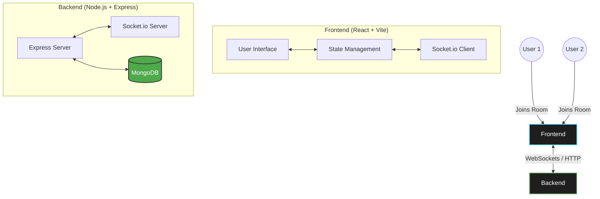

<div align="center">
  

  # 🚀 Real-Time Developer Collaboration Platform
  
  <p align="center">
    <a href="https://reactjs.org/"></a>
    <a href="https://vitejs.dev/"></a>
    <a href="https://tailwindcss.com/"></a>
    <a href="https://nodejs.org/"></a>
    <a href="https://socket.io/"></a>
    <a href="https://www.mongodb.com/"></a>
  </p>

  ### *Collaborate on code and notes instantly—no sign-in required!*
</div>

---

## 🌟 Overview

The **Real-Time Developer Collaboration Platform** is designed for modern developers to hop into a shared workspace seamlessly. Using unique room codes, teams can synchronize live code, brainstorm via notes, and communicate without any onboarding friction. 

Whether you're pair programming, conducting a technical interview, or simply sharing snippets, this platform delivers a **low-latency, high-performance experience**.

## ✨ Features

- **Instant Rooms**: Generate or join unique room codes instantly.
- **No Auth Required**: Jump straight into collaboration.
- **Live Code Sync**: Real-time editor synchronization powered by WebSockets.
- **Modern UI**: Dark-mode first, built with Tailwind CSS and Framer Motion for smooth animations.
- **Responsive Design**: Works seamlessly on desktop and mobile.

---

## 🏗️ Architecture (Mermaid Diagram)



---

## 📅 Roadmap (Week 1 & 2 Focus)

### Week 1 — Web Development Fundamentals
- [x] Basic project scaffolding
- [x] Setting up frontend and backend communication channels
- [x] Initializing Vite, Node.js, and MongoDB

### Week 2 — React & Frontend Basics
- [ ] React.js fundamentals & component architecture
- [ ] Responsive UI via Tailwind CSS & Framer Motion
- [ ] Homepage and Join Room interface implementation
- [ ] React state management for live updates

---

## 🚀 Getting Started

### Prerequisites

- [Node.js](https://nodejs.org/) (v16+)
- [npm](https://npmjs.com/) or [yarn](https://yarnpkg.com/)

### Installation

1. **Clone the repository**
   ```bash
   git clone https://github.com/your-username/real-time-dev-collab.git
   cd real-time-dev-collab
   ```

2. **Install frontend dependencies**
   ```bash
   npm install
   ```

3. **Start the development server**
   ```bash
   npm run dev
   ```

## 🎨 UI Preview

*(Add your awesome animated GIFs or screenshots here once the UI is complete!)*
<br>
<div align="center">
  
  
  
</div>
<br>

---

<div align="center">
  Built with ❤️ by Ayush Tripathi.
</div>
